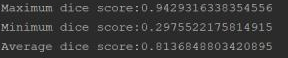

# Using
1. Firstly, create new folder and clone repository
> git clone https://github.com/vovaklh/2018-Data-Science-Bowl.git

2. Secondly, create new virtual environment

3. Install need libraries
> pip install -r requirements.txt

4. To train model open terminal and run the follwing code
> python train.py -- index (name_of_model) --height (input_height) --width (input_height) 

You also can select path to train data (if you use new train or test data, **remove numpy arrays**), size of batch and number of epochs, loss function and use residual blocks or not.

5. To make predictions open terminal and run the following code
> python predict.py --test (path_to_test) --height (height_to_resize) --width (width_to_resize) --model (path_to_model).

If we using ****new test data or masks**, remove numpy arrays. You also can select the name of saved predictions, threshold value and run run length encoding or not

# Data
## Data overview
Dataset contains a large number of segmented nuclei images. 
The images were acquired under a variety of conditions and vary in the cell type, magnification, 
and imaging modality (brightfield vs. fluorescence). The dataset is designed to challenge an algorithm's ability to generalize across these variations. Each image is represented by an associated ImageId. Files belonging to an image are contained in a folder with this ImageId. Within this folder are two subfolders:
- images contains the image file.
- masks contains the segmented masks of each nucleus. This folder is only included in the training set. Each mask contains one nucleus. Masks are not allowed to overlap (no pixel belongs to two masks).

## Exploratory data analysis
Firstly, I checked dimension of images. I noticed that images in test and train data  have **different shapes**. The most frequent image dimension in train and test set is (256, 256, 3). I made decision to resize all images and their masks to shape (256, 256, 3)
- Images in train

- Images in test

Secondly, i create **create color features** and saw that there was differences between our training and testing sets.

At the last step i did **cluster analysis** using k-means algorithm. There was four different clusters and some of them weren't in the test set.

## Data preprocessing
As i mentioned above I resized all images to one image dimension. Also i converted training images to grayscale and divided by 255 to have pixel values in range 0-1.

## Data augmentation
Data augmentation is helpfull technique when we want model to generalize well. I used Keras class **ImageDataGenerator** to make it. All augmentation was made on place, I didn't expand current images and masks.
I use the next:
- rotation
- width_shift_range
- height_shift_range
- shear_range
- zoom_range
- horizontal_flip
- vertical_flip

# Model
## Model overview
I used the common arhitecture called **Unet**. UNet architecture was a great step forward in computer vision that revolutionized segmentation not just in medical imaging but in other fields as well. I implemented it using **Keras**.

 
Another revolutionary advancement in computer vision was **ResNet**. The residual blocks in ResNet with skip connections helped in making a deeper and deeper convolution neural network and achieved record-breaking results for classification on the ImageNet dataset.

 

I have **trained 4 models** with batch size 16. I splited training data into train(85 %) and validation(15 %) First two models have 2 million parameters and second two have 8 million parameters. Two models have residual convolutions blocks in encoder, decoder and middle layer.  Replacing convolutions in U-Net on each level with ResBlock, we can get better performance than the original UNet almost every time.
The **best model** has next 8 million parameters and residual blocks. 

## Loss function
I used combination of binary cross entropy loss and dice coefficient. 

## Metric
The **dice coefficient** was metric to evaluate model. Also i include iou metric.

## Model history
Model loss 

Model dice

## Results
I got the next results.

As we can see model generalize well but at some images dice score less than 0.5. The cause of it that this images was from **other** distribuiton. The solution of it is to add this images in training data.

